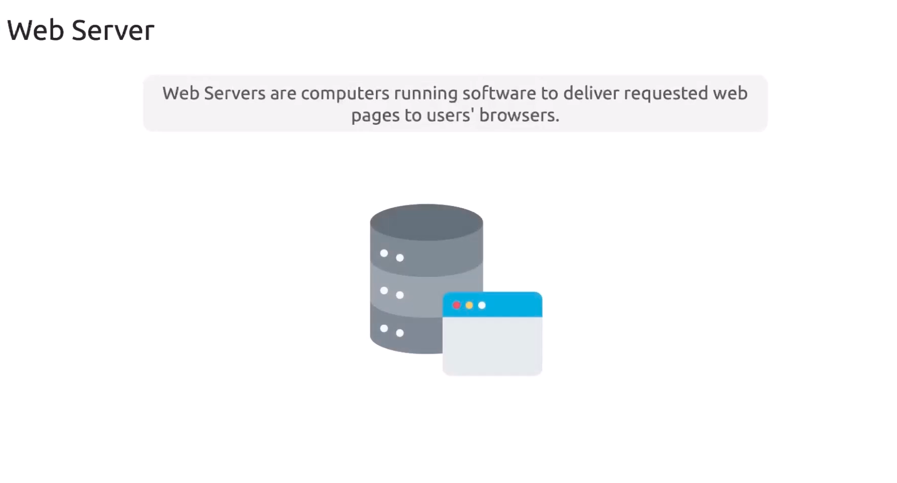
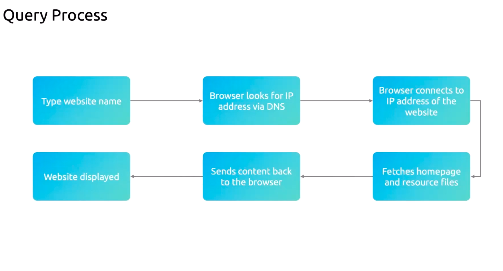
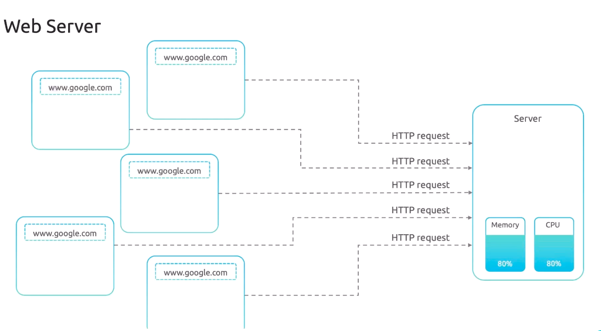
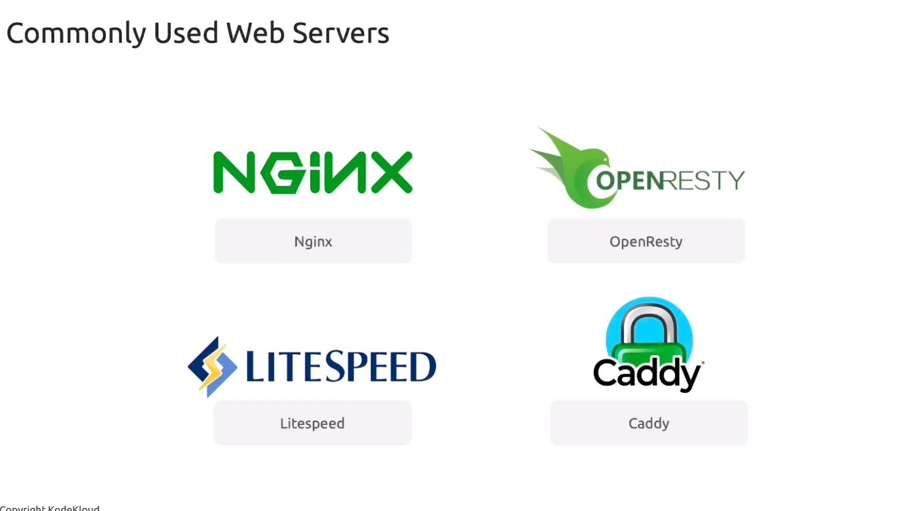

# Web Servers

>A **web server** combines *hardware* and *software* to process client requests and serve web content—`HTML`, `CSS`, `JavaScript`, `images`, and more—back to your browser.

## How a Browser Loads a Web Page

When you type a URL (for example, `ribesh-shrestha.com.np`) into your browser:

1.  The browser queries the **DNS (Domain Name System)** to resolve the *domain name* into an *IP address*.
    
2.  After obtaining the IP, **it establishes a TCP connection to the server**.
    
3.  The server receives the `HTTP/HTTPS` request, gathers the requested assets, and sends a response back.
    
4.  Your browser **renders the response, displaying the web page**.

>**Note:**
Think of `DNS` like a phone book—translating human-friendly domain names into machine-friendly IP addresses.

## HTTP vs. HTTPS

Web servers communicate over two main protocols:

-   **HTTP (HyperText Transfer Protocol)** – unencrypted
    
-   **HTTPS (HTTP Secure)** – encrypted with TLS/SSL

Most browsers redirect **HTTP** requests to **HTTPS** to protect data in transit.

>**Warning:** Transmitting sensitive information over plain **HTTP** can expose data to eavesdropping and man-in-the-middle attacks. Always prefer **HTTPS**.

---

### Traditional vs. Modern Server Architectures
Legacy Servers: **Apache** & **IIS**

-   **Apache HTTP Server** (⟶ mid-1990s) uses a process-per-connection or thread-per-connection model.
    
-   **Microsoft IIS** launched around the same time with a similar architecture for Windows environments.

>Spawning new processes for each request leads to increased CPU and memory usage under high load:

### Modern Alternatives

Today's high-traffic sites distribute requests across clusters of servers behind load balancers. Popular event-driven and asynchronous servers include:

|Web Server| First Released| Concurrency Model| Key Benefit|
|-----|------|------|------|
| **Nginx**| 2004 | Event-driven, async| Low memory footprint, high concurrency|
| **OpenResty**| 2011| Nginx + Lua Modules| Extensible with Lua scripting|
| **LiteSpeed**| 2003 | Event-driven| Drop-in Apache replacement option|
|**Caddy** | 2015| Event-driven, Go| Automatic HTTPS distribution|

