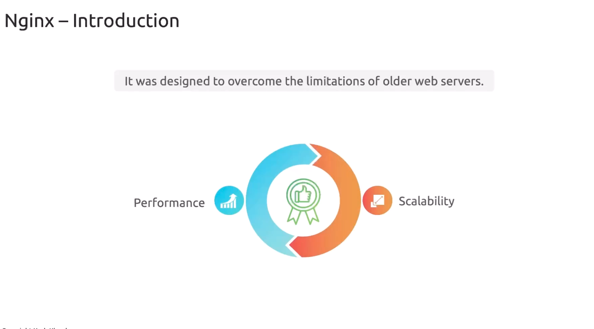

# Introduction to Nginx

### What is NGINX?

-   NGINX is a **high-performance web server** first released over 20 years ago. 

-   It’s available in two editions: 
    -   the open source Community Edition and 
    -   the commercial NGINX Plus. 
    
>`NGINX` powers **static content delivery**, **load balancing**, **reverse proxy**, and more—across Linux, macOS, and Windows.

---
### Cross-Platform Support

>`NGINX` overcomes the **scalability** and **performance** bottlenecks of legacy web servers. 

-   It installs easily on all major operating systems and delivers consistent throughput under heavy load.

---

### Historical Context

Originally created to challenge **Apache HTTP Server** and **Microsoft Internet Information Services (IIS)**, `NGINX` quickly gained traction thanks to its lightweight, asynchronous design.

### Asynchronous, Event-Driven Architecture

-   One of `NGINX’s` key innovations is handling **10,000+ concurrent connections** with minimal overhead. 

-   This makes it ideal for **serving static assets**—`HTML`, `images`, `audio`, and `video—more` efficiently than traditional, process-based servers.

>**Note:** `NGINX` processes multiple client requests within a single worker process using non-blocking I/O.

|Feature| NGINX| Apache|
|----|-----|-----|
|Architecture| Asynchronous, event-driven| Process/thread-based|
| Max. Concurrent Connections| >=10,000| Varies, lower throughput|
|CPU & Memory Usage| Low| Higher|
|Static Content Performance| Excellent | Good|

>Recent benchmarks show `NGINX` can handle **up to four times** as many connections as `Apache`, with lower latency and reduced resource consumption.

---
### Nginx Editions

|Edition| Key Features| Support | Download URL|
|-----|-----|-----|-----|
|Community (Open Source)|Core HTTP, reverse proxy, load balancing|Community forum|https://nginx.org/download|
|NGINX Plus (Commercial)|Advanced modules, dashboard, WAF, 24×7 support|Paid subscription|https://nginx.com/products/nginx-plus|

---

