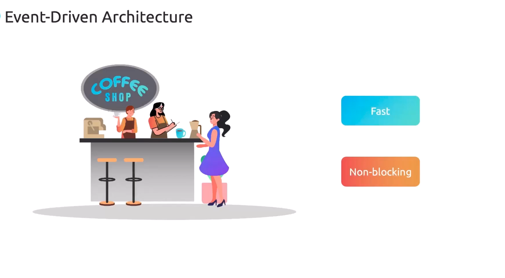
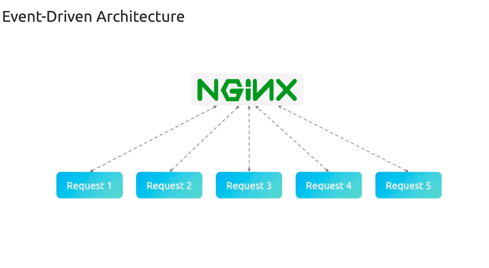
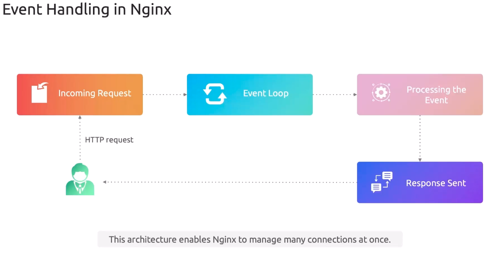
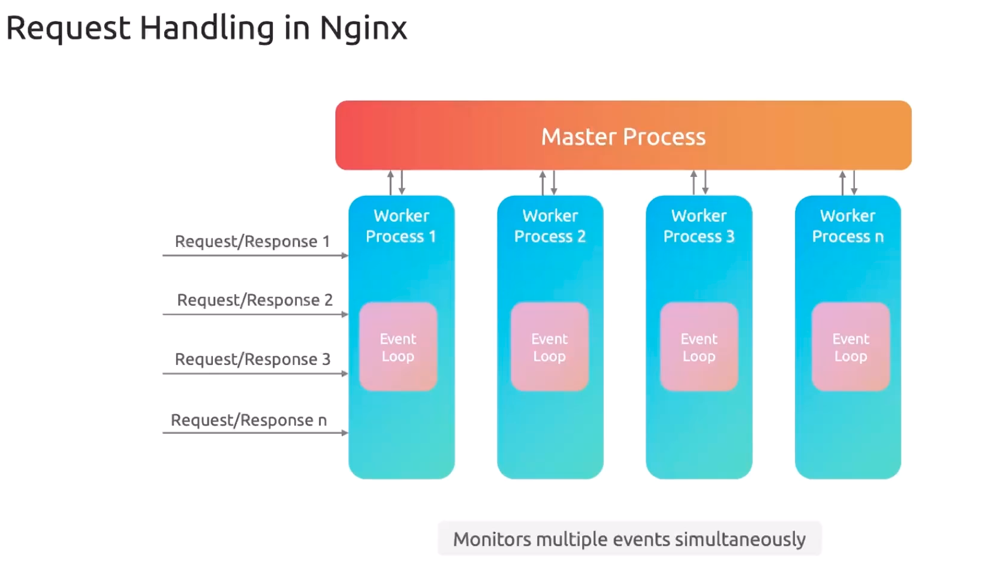

# Nginx Architecture

-   In modern web environments, servers must handle thousands of simultaneous connections with minimal latency. 

-   Nginx achieves this through a lightweight, non-blocking event-driven architecture paired with a master–worker process model. 

## Event-Driven Architecture Overview

Imagine stepping into a busy coffee shop:

    
-   One barista takes orders.
-   Another barista prepares drinks.
-   Neither barista waits idle—they coordinate tasks asynchronously.

Like that coffee shop, 
    
-   `Nginx` listens for new events, delegates work, and immediately returns to watching for additional activity.

## How Nginx Manages Asynchronous Processing

Under the hood, `Nginx` uses **non-blocking I/O** and a **single-threaded event loop** per worker to juggle connections efficiently:

>**Note:** `Nginx`’s **asynchronous event loop** ensures that while one request awaits data (disk I/O, upstream response), the worker can serve other clients without delay.

### The Restaurant Analogy: Mapping Requests to Events

A busy restaurant operates much like `Nginx`:

-   **Waiter (Event Loop)** takes multiple orders without waiting for dishes.
-   **Chef (Worker Process)** prepares meals and notifies the waiter when each is ready.

In `Nginx` terms, each `HTTP` request follows these steps:

1.  **Incoming Request**
    -   The client issues an HTTP/S request.
2.  **Event Loop**
    -   `Nginx` accepts the connection and returns immediately to monitor other events.
3.  **Processing Event**
    -   The worker reads files, queries databases, or proxies to an upstream server. 
        -   If I/O is required, it switches context to serve another request.
4.  **Response Sent**
    -   Once processing completes, `Nginx` replies to the client and continues the loop.

#### Step-by-Step Flow

-   **Accept**: New connection arrives.
-   **Register**: Connection is added to the event loop.
-   **Dispatch**: Worker processes available events.
-   **I/O Wait**: If blocked, event loop switches to another request.
-   **Complete**: Response is sent when processing is done.

## Master and Worker Processes

-   To leverage multi-core CPUs and isolate failures, Nginx uses a **master–worker architecture**:

| Process Type| Responsibility | Handles Client Requests?|
|----|----|----|
| **Master**| Reads configuration, spawns/reloads worker processes| No|
| **Worker**| Runs event loop, accepts connections, processes requests| Yes|

### Master Process

    
-   Supervises worker lifecycle
-   Reloads configuration without downtime
-   Never blocks on I/O or client handling

### Worker Processes

    
-   Each runs an independent, single-threaded event loop
-   Handles connection acceptance, reading, writing, and multiplexing
-   Scales across CPU cores by running multiple workers
