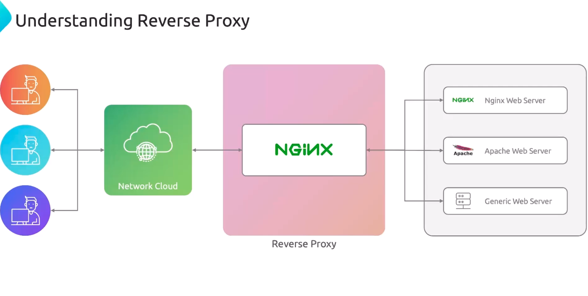
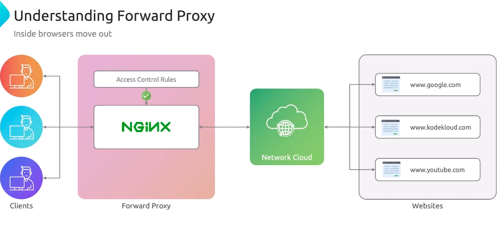
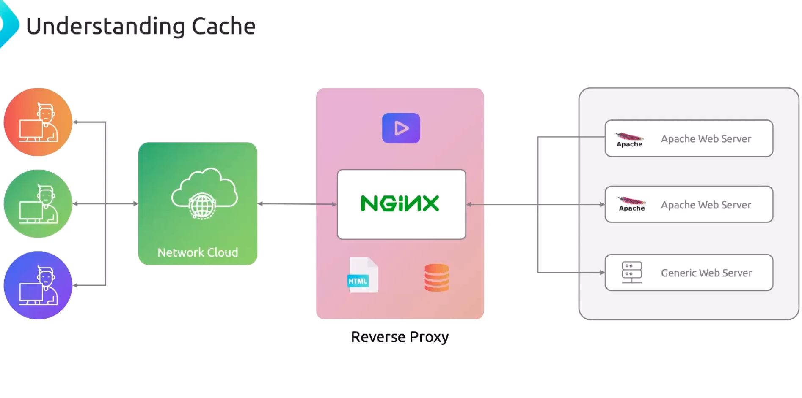

# Nginx Use Cases

>`Nginx` is more than a **high-performance web server**. 

-   It can improve your architecture by acting as a **load balancer**, **reverse proxy**, **forward proxy**, or **caching layer**—boosting scalability, reducing latency, and enhancing security.


#### Key benefits include:

-   Distributing requests for high availability
-   Offloading SSL/TLS and request routing
-   Caching responses to cut backend load
-   Controlling outbound traffic and anonymizing clients


## Load Balancing

By distributing incoming requests across multiple servers, `Nginx` **prevents any single backend from becoming a bottleneck**. 

>You declare an `upstream` block listing your servers, then proxy traffic to it.

```bash
upstream backend {
    server backend1.example.com;
    server backend2.example.com max_fails=3 fail_timeout=30s;
}


server {
    listen 80;
    location / {
        proxy_pass http://backend;
    }
}
```

>**Note:** `Nginx` supports multiple algorithms including `round_robin` (default), `least_conn`, and `ip_hash`. Choose one based on your workload characteristics.


## Reverse Proxy

A **reverse proxy** accepts client requests, applies routing or SSL offloading, then forwards them to one or more backend servers. 
>This hides your infrastructure behind a single public endpoint.


```bash
server {
    listen 443 ssl;
    server_name example.com;


    ssl_certificate     /etc/nginx/ssl/example.crt;
    ssl_certificate_key /etc/nginx/ssl/example.key;


    location / {
        proxy_pass       http://internal_app;
        proxy_set_header Host $host;
        proxy_set_header X-Real-IP $remote_addr;
    }
}
```




## Load Balancer vs. Reverse Proxy

|Feature|Load Balancer| Reverse Proxy|
|----|----|----|
| Primary Role| Distribute traffic across servers| Intercept and forward requests|
|Backend Servers| Requires two or more | Can work with a single server|
|Common Use Cases| Scaling, failover, health checks| SSL/TLS termination, path-based routing|


## Forward Proxy

A forward proxy sits between **clients** and the **internet**, filtering or anonymizing outbound requests. 
>Configure Nginx to restrict sites or mask client IPs for privacy.

```bash
server {
    listen 3128;


    resolver 8.8.8.8;
    proxy_pass_request_headers on;


    location / {
        proxy_pass $scheme://$http_host$request_uri;
        proxy_hide_header Proxy-Authorization;
    }
}
```


>**Warning:** Opening a **forward proxy** to the public can lead to abuse. Always secure it with `allow/deny` or authentication mechanisms.




## Caching

Caching with `Nginx` reduces response times and eases load on backend services. 
>Define a cache zone, set key parameters, and control how responses are stored.

```bash
proxy_cache_path /var/cache/nginx levels=1:2 keys_zone=my_cache:10m 
                 inactive=60m max_size=1g;


server {
    listen 80;
    location / {
        proxy_cache my_cache;
        proxy_pass http://backend;
        proxy_cache_valid 200 302 10m;
        proxy_cache_valid 404 1m;
    }
}
```


>**Note:** Monitor **cache** usage and tune `inactive` and `max_size` to avoid running out of disk space. Use `proxy_cache_bypass` for selective caching.

